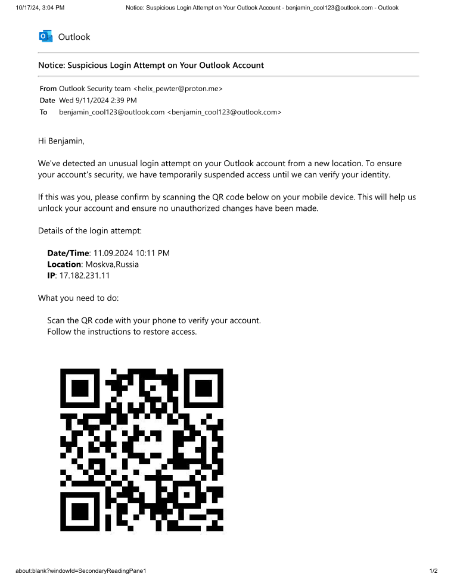

**Writeup author: Oslolosen**

*We have obtained a memory dump from a user who suspects unauthorized access to their computer following a phishing attack. Can you investigate what occurred?*

In this task, we are provided with a memory dump from an infected system that was received through a phishing email (as surprisingly mentioned in the task description).

There are no profile or symbols included with the task, so it was likely a Windows system. Therefore, using Volatility 3, it’s possible to investigate the memory dump. I typically begin by looking for any suspicious commands before examining the process list.
```sh
vol3 -f dump.dmp windows.cmdline
```

The output of this command reveals a lot of interesting information that will also be useful for the subsequent task. Most notably, it shows that `security email.pdf` was executed using `NOTEPAD.EXE`.
```sh 
"C:\Windows\system32\NOTEPAD.EXE" C:\Users\Benjamin\Documents\security email.pdf
```

To extract this file for closer inspection, Volatility can create a layout of the file structure to locate the memory address of the PDF file, allowing us to dump and open it.
```sh
vol3 -f dump.dmp windows.filescan > filescan.txt

cat filescan.txt | grep "security email.pdf"
	0xc50ce5139980	\Users\Benjamin\Documents\security email.pdf

vol3 -f dump.dmp -o files/ windows.dumpfile --virtaddr 0xc50ce5139980
	Volatility 3 Framework 2.5.2
	Progress:  100.00		PDB scanning finished                                
	Cache	FileObject	FileName	Result

DataSectionObject	0xc50ce5139980	security email.pdf	file.0xc50ce5139980.0xc50ce5c1ea70.DataSectionObject.security email.pdf.dat
```

After opening the file, it displays a PDF document containing text and a QR code.


A quick scan of the QR code reveals a URL containing the flag:
```
https://EPT{pHi5h1ng_st1ll_w0rk5???}.com
```

**FLAG: EPT{pHi5h1ng_st1ll_w0rk5???}**
