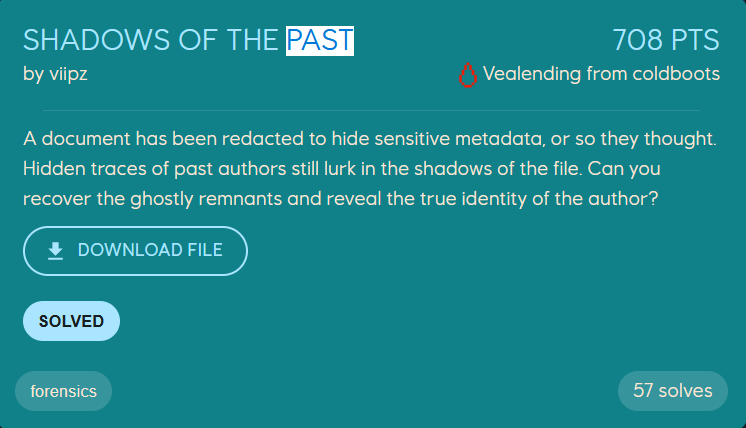

# Writeup
author: th0m45 @ FesseMisk

## Shadows of the Past



the attached file is a compressed 7z file. We can decompress using the `7z` tool.

```bash
$ 7z e economicsreport.7z

``` 
Now we can look for metadata of the pdf file extracted using `exiftool`.

```bash
$ exiftool Economics\ Report.pdf
ExifTool Version Number         : 12.40
File Name                       : Economics Report.pdf
Directory                       : .
File Size                       : 75 KiB
File Modification Date/Time     : 2024:09:18 13:26:45+02:00
File Access Date/Time           : 2024:11:10 10:49:51+01:00
File Inode Change Date/Time     : 2024:11:10 10:49:51+01:00
File Permissions                : -rwxrwxrwx
File Type                       : PDF
File Type Extension             : pdf
MIME Type                       : application/pdf
Linearized                      : No
Page Count                      : 1
Page Layout                     : OneColumn
PDF Version                     : 1.6
XMP Toolkit                     : Image::ExifTool 12.40
Author                          :
Producer                        : PyFPDF 1.7.2 http://pyfpdf.googlecode.com/
Title                           : Economic Trends Report - Q3 2024
Subject                         : Economics Report
Keywords                        : Economics, GDP, Inflation, Q3 2024
Create Date                     : 2024:09:18 11:20:03
Creator                         : PDF24
``` 
Exiftool did not reveal much. We can use binwalk to extract files and content from the PDF we got when decompressing the 7z file.

```bash
$ binwalk -e "Economics\ Report.pdf"

``` 
binwalk creates a new folder contaning the results

```bash

$ cd _Economics\ Report.pdf.extracted/

``` 
We can use `strings *` to list all readable strings in all files that binwalk extracted for us, and then we can use grep to search for the flag which we know begins with "EPT".

```bash
$ strings * | grep -i EPT
1 0 2 73 3 180 5 301 6 387 9 468 <</Type /Pages /Kids [3 0 R ] /Count 1 /MediaBox [0 0 595.28 841.89 ] >> <</ProcSet [/PDF /Text /ImageB /ImageC /ImageI ] /Font <</F1 5 0 R /F2 6 0 R >> /XObject <</I1 7 0 R >> >> <</Type /Page /Parent 1 0 R /Resources 2 0 R /Group <</Type /Group /S /Transparency /CS /DeviceRGB >> /Contents 4 0 R >> <</Type /Font /BaseFont /Helvetica-Bold /Subtype /Type1 /Encoding /WinAnsiEncoding >> <</Type /Font /BaseFont /Helvetica /Subtype /Type1 /Encoding /WinAnsiEncoding >> <</Producer (PyFPDF 1.7.2 http:```pyfpdf.googlecode.com/) /Title (Economic Trends Report - Q3 2024) /Subject (Economics Report) /Author (EPT{1_am_h1dd3n_n0w_r1ght??}) /Keywords (Economics, GDP, Inflation, Q3 2024) /CreationDate (D:20240918112003) /Creator (PDF24) >>

``` 
We can now see the flag i a file metadata as "Author". Might not be the inteded solution, but I got the flag fairly fast and easy.


**EPT{1_am_h1dd3n_n0w_r1ght??}**

