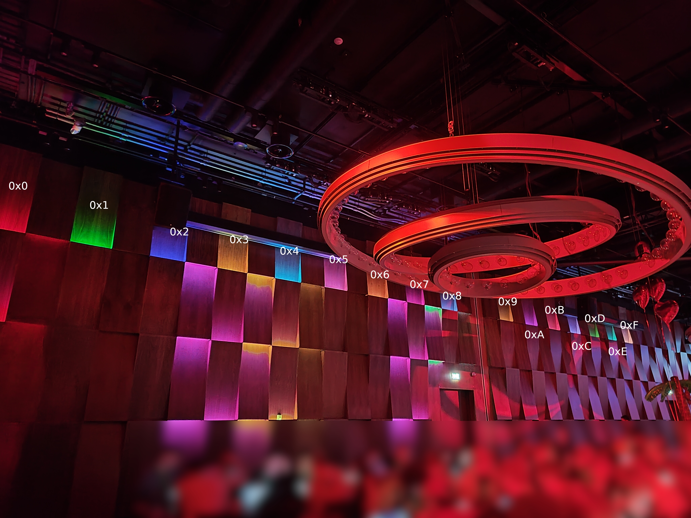

# Pixel Perfect
We know _something_ has changed in the room, but what?

## Solution
So after looking around the room a bit `404'd` pointed our the wall in front of us.

We saw that that there was 16 static lights on the top of the wall, and "pairs" of colors moving underneath:

I started with the asumption that this was a key, written as follows.


This was quickly validated when the "pairs" rolling over the wall was valid ascii.

For example:


A demo of the content can be seen here.
https://youtu.be/zG_ZtwGyFQY


Now the acutal decoding had quite a few issues. Firstly the color grading on my phone in darkness is... bad.
The colors `0x5, 0x7 and 0xA` (Pink/Purple) looked rather similar. Same goes for Yellow brown: `0x3 0x6 and 0x9` and blues: `0x4 0x8 and 0xE`. This caused a lot of issues, as the video chould only get me so far. On top of that the pixel wall was turned off every time a Fist Blood was announced, as well as during the replays later in the day. And just to top it off, the pixel wall application crashed after a announcement, so there was timespans where it was generally unavaliable.

The approach i took for solving the chall with dubious color data was to try to write out the combinations that might be the correct one, and filter out all that is not valid ascii (as in whitespace or printable).

After some base work i noticed that the light ended with 0x7d, or `}`.
From there i hunted down `{` and checked the three chars before. 

Which thankfully spelled out `EPT{`

```
45 47 4A    # E | G | J
50 70       # P | p
54 74       # T | t 
75 A7 A5 7B # {
```

So now i knew the part of the video that was important and focused on that, rather than the whole string.

This can be seen in the 2nd and 3rd attempt notes underneath.

Even with the mapping of possible chars i still had some issues, which was later resolved with manual validation by looking at the wall using our eyes, together with `Blissy`.

  
Flag: `EPT{c0l0r_m3_h4ppy}`

## Notes written underways
### 1st Try
```
55 77 AA
30 60 90
30 60 90
50 70 A0

30 90

55 77 AA

30 60 90
30 60 90
50 70 A0

21 D1 E1
20 

54 64 A4

34
35 37 3A
20
33
38
31
35 37 

20

44
53 63

4B
10
45 47
50 70
54 74
74

94 49
40 90

48 45
```

### 2nd Try
```
93 96 69 63 # i | c
74 76 A4 A6 # t | v
3A 4A       # : | J
20          # _ # 37 Blue Red
45 47 4A    # E | G | J
50 70       # P | p
54 74       # T | t 

75 A7 A5 7B # {     # 44
75 A5 A7    # u
70 50 A0    # p | P
40 60 90    # @
A2 52 72    # ¢ | R | r
5F 7F AF    # _ | ¯
61 6D       # a | m
44 77 AA    # D | w
75 A5       # u
62 92 65 69 # b | e | i
45 4D       # e | M
50 70       # p | P
50 70       # p | P
74 54       # t | T
71 51 7D 5D # }
```

### Third try
```
45       # E
50       # P
54       # T 
7B       # {

63                  # c          # Orange Yellow
30                  # 0
62 64 68 6C         # l | d | h | b
60 90 30 F0         # 0
A2 72 52            # r | R
5F 7F AF            # _ |
31 61 A1 3D 6D AD   # 1 | a | m | =
33                  # 3
7F 5F AF            # _

34                  # h | d # Yellow Light blue
64 94 38            # 4 | d | 8 | h # Orange Light blue
50 70 A0            # p | P | " "
50 70 A0            # p | P | " "
53 73               # s | S <-- Issue here, was 'y'
```

### Examples:
EPT{c0l0r_m3_b8pps}  
EPT{c0l0r_m3_48pps}  
EPT{c0l0r_m3_h4ppy}  

